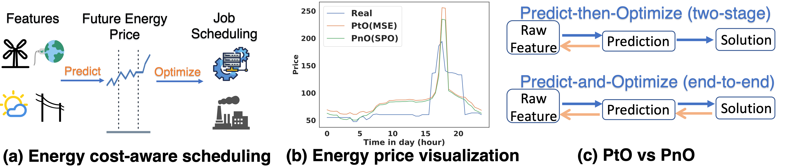
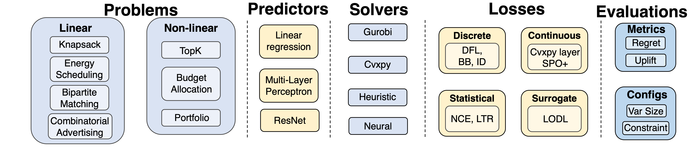

<h1 align="center"><b> PredictiveCO Benchmark </b></h1>

Official Implementation of NeurIPS 2024 Datasets and Benchmarks Track paper:    
"Benchmarking PtO and PnO Methods in the Predictive Combinatorial Optimization Regime"


This repository provides the base code for Predictive-CO.

## Abstract

Predictive combinatorial optimization, where the parameters of combinatorial optimization (CO) are unknown at the decision-making time, is the precise modeling of many real-world applications, including energy cost-aware scheduling and budget allocation on advertising. Tackling such a problem usually involves a prediction model and a CO solver. These two modules are integrated into the predictive CO pipeline following two design principles: ''Predict-then-Optimize (PtO)'', which learns predictions by supervised training and subsequently solves CO using predicted coefficients, while the other, named ''Predict-and-Optimize (PnO)'', directly optimizes towards the ultimate decision quality and claims to yield better decisions than traditional PtO approaches. However, there lacks a systematic benchmark of both approaches, including the specific design choices at the module level, as well as an evaluation dataset that covers representative real-world scenarios. To this end, we develop a modular framework to benchmark 11 existing PtO/PnO methods on 8 problems, including a new industrial dataset for combinatorial advertising that will be released. Our study shows that PnO approaches are better than PtO on 7 out of 8 benchmarks, but there is no silver bullet found for the specific design choices of PnO. A comprehensive categorization of current approaches and integration of typical scenarios are provided under a unified benchmark. Therefore, this paper could serve as a comprehensive benchmark for future PnO approach development and also offer fast prototyping for application-focused development.

## Predictive-CO Benchmark    


Example of combinatorial optimization under uncertain coefficients for energy cost-aware scheduling, and illustration of PtO and PnO.


### Modular Framework    
In this benchmark, we provide modular framework implementation where users can adopt their own deployments on specific problems, predictors, solvers, losses and evaluations.    




## Use of Predictive-CO Benchmark    

### Install    
Prior to running this benchmark, you could install this package locally using:    
```
pip install -e .
```
### Dataset

data access link: https://drive.google.com/file/d/10OQLzWS5b4EEEFjPc4YeVhxQ_021GoWW/view?usp=sharing

Please put the unzipped folder to the "./openpto/data/" to run the code directly, or specify "--data_dir" as the data folder in other places.

### Run of PtO and PnO algorithms    
Please refer to the shell under ''shells/benchmarks'' folder for the specific problems.    

For specifications of hyper-parameters, please refer to ```openpto/config/utils_conf.py```.

## Citation

If you find our work useful in your research, please consider citing:
```bibtex
@inproceedings{geng2024predictive,
  title={Benchmarking PtO and PnO Methods in the Predictive Combinatorial Optimization Regime},
  author={Geng, Haoyu and Ruan, Hang and Wang, Runzhong and Li, Yang and Wang, Yang and Chen, Lei and Yan, Junchi},
  booktitle={NeurIPS 2024 Datasets and Benchmarks Track},
  year={2024}
}
```

## Acknowledgement    
Some of the code and datasets are derived from works in historical literature, as annotated in the appendix of the paper.
When you use this benchmark dataset, please comply with the terms of use specified in Appendix C.

